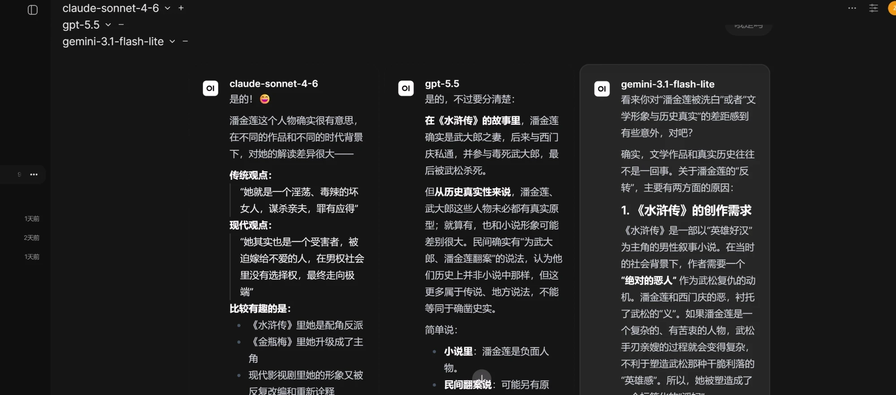

<!--
本文为「完整技术版」（含代理/分流细节），用于个人博客 / GitHub。
公众号请用素材包里的「合规版」。
原稿提供三个备选标题：
1. 我把 ChatGPT 和 Claude 的订阅，变成了自己家的 API，挂 NAS 上 24 小时跑
2. 放弃折腾一周的开源工具后，我用一天搭了个"全家共享的多模型 AI 入口"
3. 不用额外买 API：把我已经付费的 AI 订阅，桥成一个多模型聊天站
全文已脱敏：真实域名/邮箱/key/内网名一律为占位，请勿替换成真值。
-->

# 一天搭建自己的多模型 AI 网关：把付费订阅变成全家共享入口

## 导语

我一直想要一个很简单的东西：

**输入一句话，Claude、GPT、Gemini 同时回答，并排放在一起，让我一眼看出谁更好。**

听起来不难吧？但找了一圈现成工具，没一个顺手的——要么收费、要么不让我填自己的 key、要么压根不能并排。

折腾到最后，我干脆自己搭了一个。这篇就讲讲：我怎么从"踩了个大坑"，到"一天搭出一套全家能用的多模型 AI 入口"。

---

## 一、我先走了一条死路

最开始，我盯上了一个开源项目 **ChatALL**——号称能"同时和所有 AI 聊天"。我把它 clone 下来，想自己维护一份。

结果一路全是坑：Windows 构建链报错、打包出来直接白屏……我硬是把这些 bug 都修好了，app 能正常打开了。

但就在这时候，我才看清一件更扎心的事：

**它"聚合所有 AI"靠的是模拟浏览器去抓各家网页——而这条路，今天基本已经死了。**

各家网站疯狂反爬、频繁改版，抓取逻辑根本追不上；不光是这个项目，连它官方版本自己打开都白屏。我修好的只是"打不开"，修不好的是"路线本身错了"。

> 一句话总结这段：**问题不在代码，在方向。** 网页抓取这条路，是个无底洞。

于是我把它放下，换了个完全不同的思路。

---

## 二、换个思路：不抓网页，桥接订阅

新思路其实一句话就能说清：

**别去抓网页了。改成：把"订阅"统一成一个标准 API，再用一个能并排的前端去调它。**

整套架构长这样👇

从上到下就四层：

- **客户端**：电脑浏览器、手机、各种 AI 客户端，谁都能连。
- **入口**：让我在家、在外面都能安全访问。
- **NAS**：真正干活的两个服务跑在这，24 小时在线。
- **出口**：智能分流——该走代理的走代理，该直连的直连。

---

## 三、三块拼图

**拼图①：订阅桥**

这是整套方案的灵魂。

我本来就付费用着 Claude、GPT 这些。有一个开源工具，能把这些**订阅的登录态**，统一"桥"成一个标准的、所有客户端都认识的接口（OpenAI 兼容）。

说人话：**我已经付费的那些 AI，被收拢成了一个我自己的接口。**

**拼图②：前端（Open WebUI）**

光有接口还得有个好用的界面。我选了开源的 **Open WebUI**，因为它正好满足我全部要求：

- ✅ 并排多模型，一个问题甩给好几个模型
- ✅ 能把多家答案**合成一个**（业内叫 Mixture-of-Agents）
- ✅ 能连**任意**符合标准的接口地址
- ✅ 数据全在自己手里，手机网页也能用

**拼图③：让它 24 小时活着（NAS）**

前两块如果跑在我的 Mac 上，那我合上盖、一出门，全家就都断了。

所以我把它们塞进 **NAS**，用 Docker 跑起来——**不依赖我的电脑开不开机，24 小时常驻。**

---

## 四、一个最容易搞混的点：到底哪一步要"翻墙"

这个点我必须单独拎出来讲，因为太多人一上来就被它绕晕：

**这是两件互相独立的事，千万别混：**

1. **那个聊天网页本身，不需要翻墙。** 它只是跑在我家内网的一个网页，手机连它走的是局域网。
2. **只有"出国去调用 OpenAI / Claude 这种国外模型"那一跳，才需要走代理。** 国内模型（DeepSeek、智谱、Kimi、通义）**直连就行，根本不用代理。**

所以正确做法是**规则分流**：只让国外 AI 的域名走代理，剩下的全部直连。又快又省。

---

## 五、让全家、出门也能用：远程访问

家里能用还不够，我希望在外面、用手机也能随时打开。两个工具搞定：

- **Tailscale**：把我所有设备组成一张私有网，人在外面也能"回到"家里的 NAS。
- **Cloudflare 隧道 + 门禁**：给它配一个固定网址当公网入口，再加一道门禁——**只放行我自己的邮箱**，别人连页面都进不来。

更香的是，这些代理和隧道我 NAS 上**本来就有**（之前跑别的服务搭的），直接接上去，几乎零额外成本。

---

## 六、几个真实的坑（这才是干货）

搭的过程不是一帆风顺，几个坑值得记一下：

- **服务半夜莫名其妙崩。** 查下来是 NAS 一个系统资源上限（inotify 实例数）被占满了。把上限调高，再设成开机自动执行，扛住了每晚重启。
- **有些代理节点连不上 AI 接口。** 我把节点的"健康检查"地址，从默认那个测试页**改成了 OpenAI 的真实接口**——这样连不上 AI 的坏节点会被自动判死、自动避开。
- **网页第一次打开有点慢。** 因为前端整包一百多 MB，还要跨境下载。解法很简单：**把它"添加到主屏幕"装成 APP（PWA）**，外壳缓存到本地，之后近乎秒开。

---

## 七、安全：别人偷不走我的 key

很多人自建最担心的就是 key 泄露。我的做法是：

**所有 API key 只存在服务端，永远不发给浏览器。**

就算有人进了我的网页，他也只能"在网站里用模型"，**偷不到 key**。再加上前面那道邮箱门禁 + 登录，双层保险。

---

## 八、一天下来，我到底得到了什么

收个尾。这套东西的本质是：

> 把**我已经付费的 AI 能力**，收拢成**一个属于我自己的接口**，让全家任意设备、任意客户端都能并排调用多个大模型——**一天搭完，几乎没有新增月费。**

还有一个更大的判断想分享：

**"靠抓网页来聚合多个 AI"这条路，已经走到头了**（我用 ChatALL 亲手证实了这一点）。真正可持续的方向，是 **API 聚合 + 自建前端**。与其追着各家网站改版疲于奔命，不如把能力收进自己的接口。

最后，两句诚实话：

1. 用订阅"桥"出 API，严格说属于**灰色地带**（可能触碰各家的服务条款）。自己内部用没什么问题，但别拿去滥用、更别转卖。
2. 我这套目前 **Claude 和 GPT 很稳，Gemini 的账号授权还没跑通**——不忽悠，有就是有，没有就是没有。

---

*如果你也想要一个"自己掌控、多模型并排"的 AI 入口，这套思路可以抄。具体工具名和踩坑细节，评论区/后台聊。*
